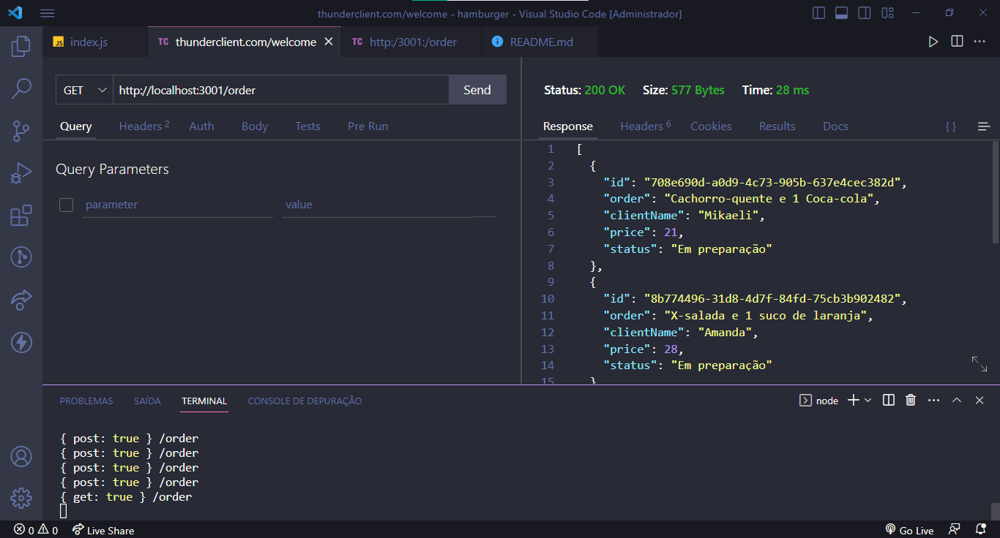
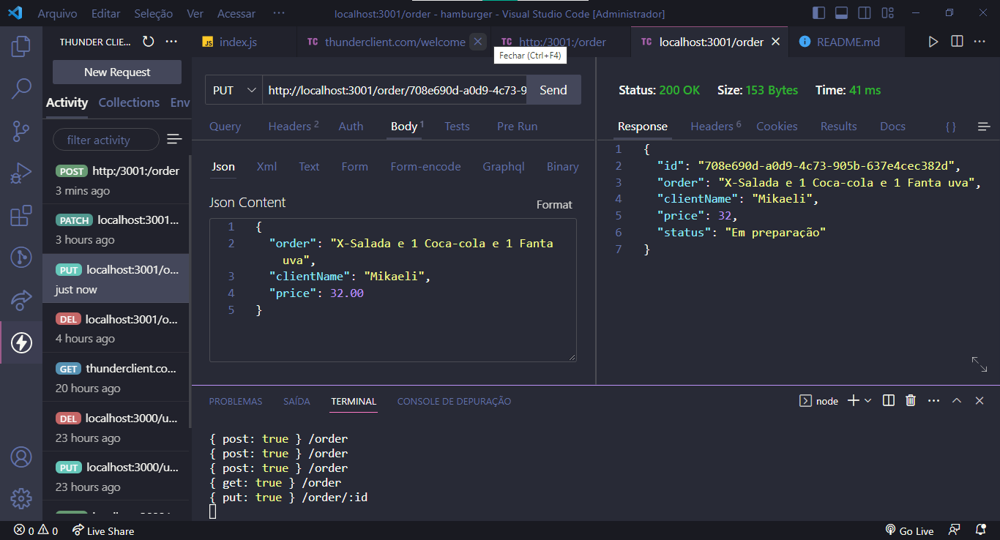
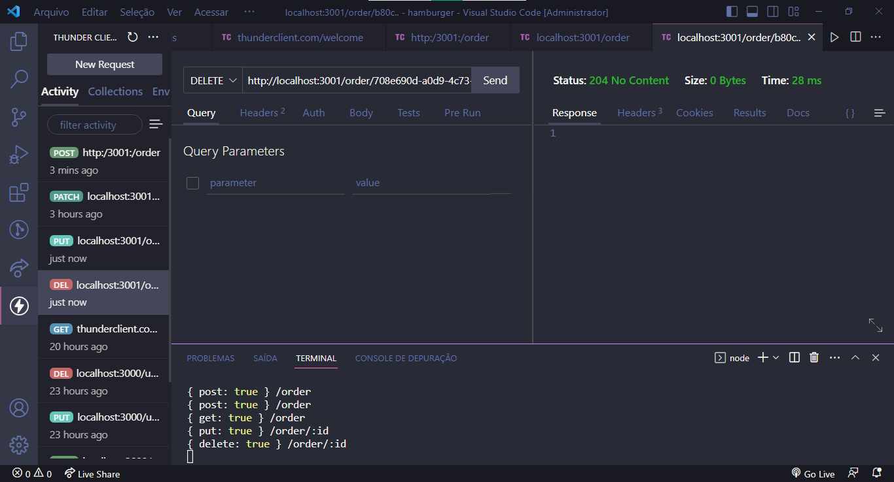
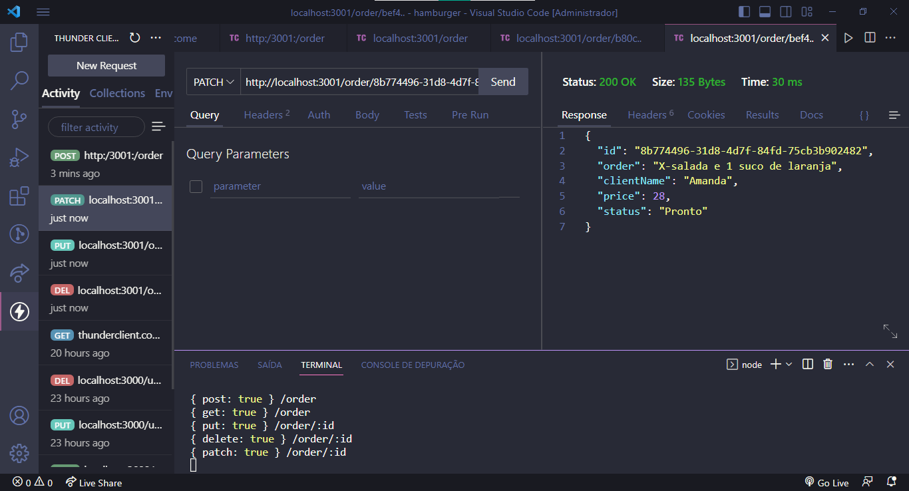

<h1 align="center">Hamburgueria EXPRESS</h1>

<H2>Rotas</h2>

- `POST /order`: O método POST é usado para enviar dados ao servidor para que sejam processados. Essa rota cria um novo pedido de hambúrguer e retorna os detalhes do pedido em formato JSON. Os dados do pedido são enviados no corpo da solicitação HTTP.

  

- `GET /order`: O método GET é usado para solicitar dados de um recurso específico. Quando um cliente faz uma solicitação GET, o servidor responde com um documento HTML que representa o recurso solicitado.

  

- `PUT /order/:id`: Essa rota atualiza um pedido existente com base no ID fornecido na URL e nos dados fornecidos no corpo da solicitação HTTP.

  

- `DELETE /order/:id`: Essa rota exclui um pedido existente com base no ID fornecido na URL.

  

- `PATCH /order/:id`: O método PATCH é usado para atualizar parcialmente um recurso. Ele permita aos funcionários atualizarem o status do pedido à medida que ele é preparado ou pronto.

  

